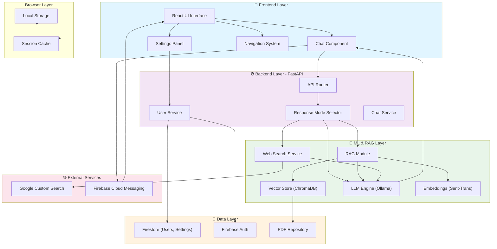
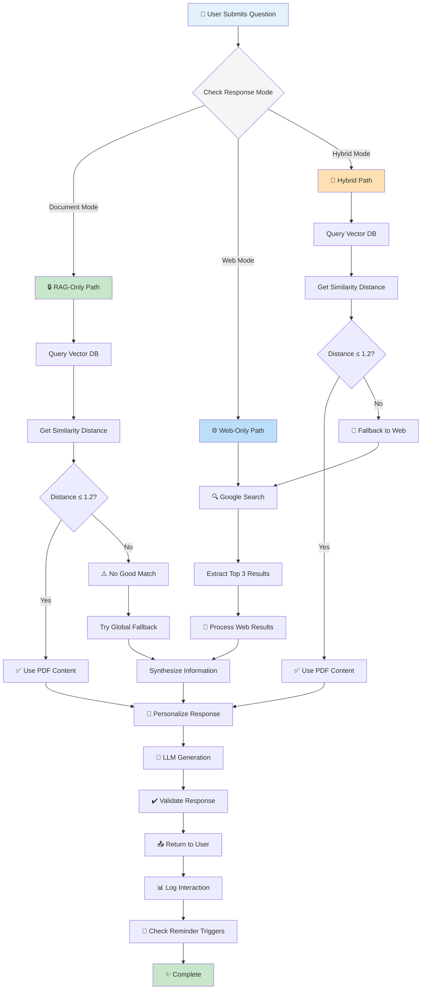
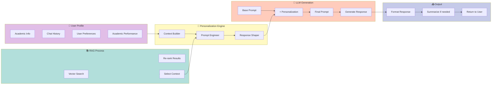
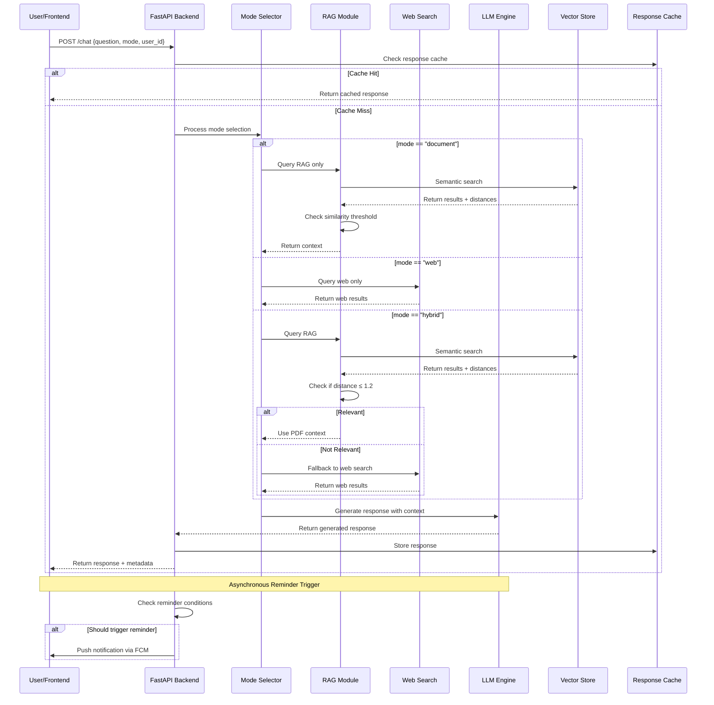
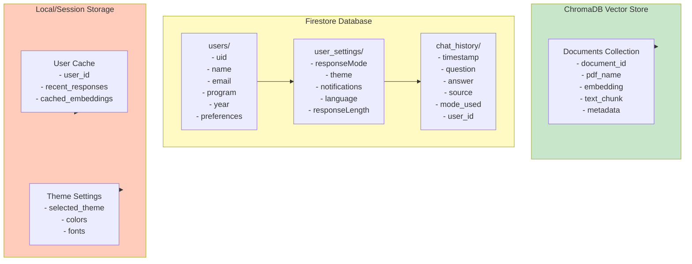
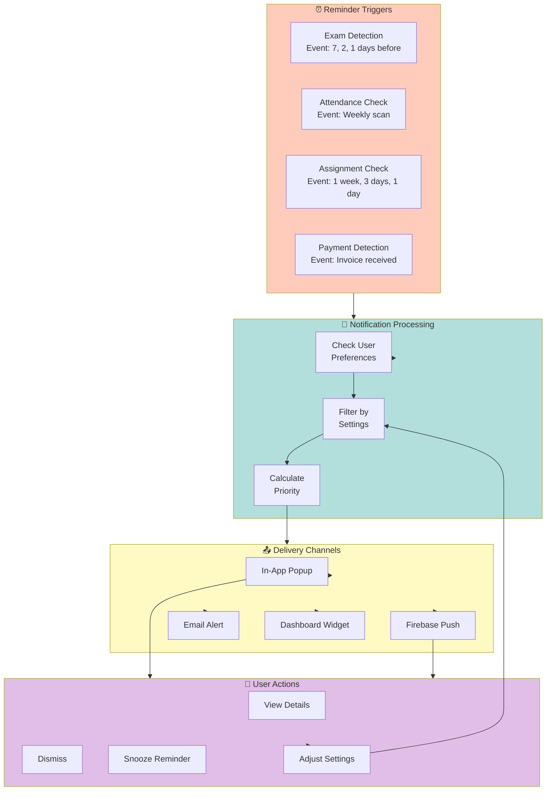
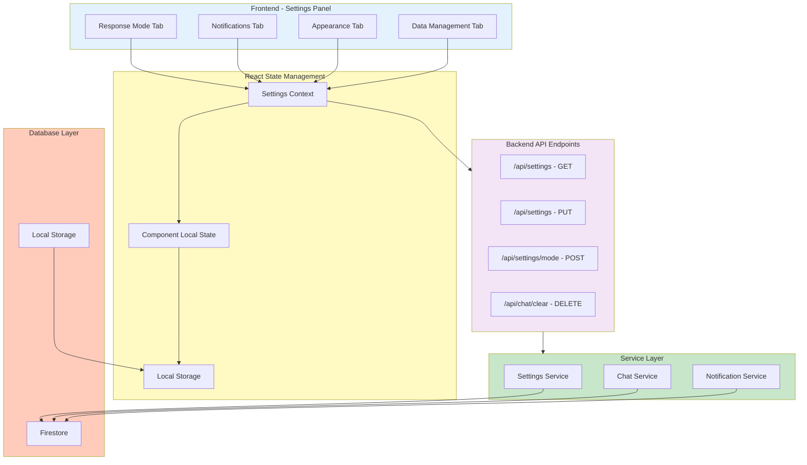

# AcademiGuard - System Architecture Diagrams

## Diagram 1: Complete System Architecture

## Diagram 2: Hybrid Retrieval Decision Flow

## Diagram 3: Personalization Framework

## Diagram 4: Request Processing Pipeline

## Diagram 5: Data Model & Storage

## Diagram 6: Notification & Reminder System

## Diagram 7: Settings Architecture

---

## Key Components Explanation

### 1. **Hybrid Retrieval System**

- Smart decision-making between RAG and web search
- Configurable similarity thresholds
- Automatic fallback mechanisms
- Source attribution and confidence scoring

### 2. **Personalization Engine**

- Multi-factor user profiling
- Adaptive response generation
- Learning from interaction patterns
- Context-aware recommendations

### 3. **Settings Panel**

- Three-mode response configuration
- Customizable notifications
- Theme preferences
- Data management and export

### 4. **Reminder System**

- Proactive alert generation
- Multi-channel delivery
- User preference filtering
- Snooze and customization options

### 5. **Data Architecture**

- Scalable vector database (ChromaDB)
- User profile storage (Firestore)
- Caching mechanisms
- Real-time synchronization
